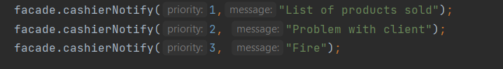

# Laboratory work №3 
## Topic: _Structural Design Patterns_
## Author: _Plotnicov Polina, FAF-193_

---
## Table of contents:
* [Introduction](#sdp-introduction)
* [Implementation](#sdp-implementation)
* [Results](#sdp-results)
---

## _SDP Introduction_

In this laboratory work were been implemented `Structural Design Patterns`. What is the purpose of such patterns?
> Behavioral design patterns are design patterns that identify common communication patterns between objects and realize these patterns.

* ### Chain of responsibility 

>The main objective of this pattern is that it avoids coupling the sender of the request to the receiver, giving more than one object the opportunity to handle the request.

>

---

## _SDP Implementation_

Duty chain is a behavioral design pattern which allows sending requests sequentially in the handlers chains.
Each of the next handlers decides then if it can handle it by itself or should it pass it next in the chain.
In our lab this pattern is implemented as the notifications for the manager. We created an abstract class "Notification" which will allow to inherit 3 types of notifications: "RoutineReport", "Intercom", "Emergency". 
Each of them has its own priority level: Routine, ASAP, Important.
Each class has nextNotifier which allows the notification with a lower priority level to be passed down the "message" chain.
In the "output" we can see that notifications with high priority level are passed the first, such as Routine Report.
Next, Intercom will be passed, and the last one is Emergency finishing the duty chain architecture.

---

## _SDP Results_

### Notifier full code

### Priority full code

### Emergency full code

### Intercom full code

### RoutineReport full code

### Method notifyManager (Cashier)

### Main partial code

- ### The output
